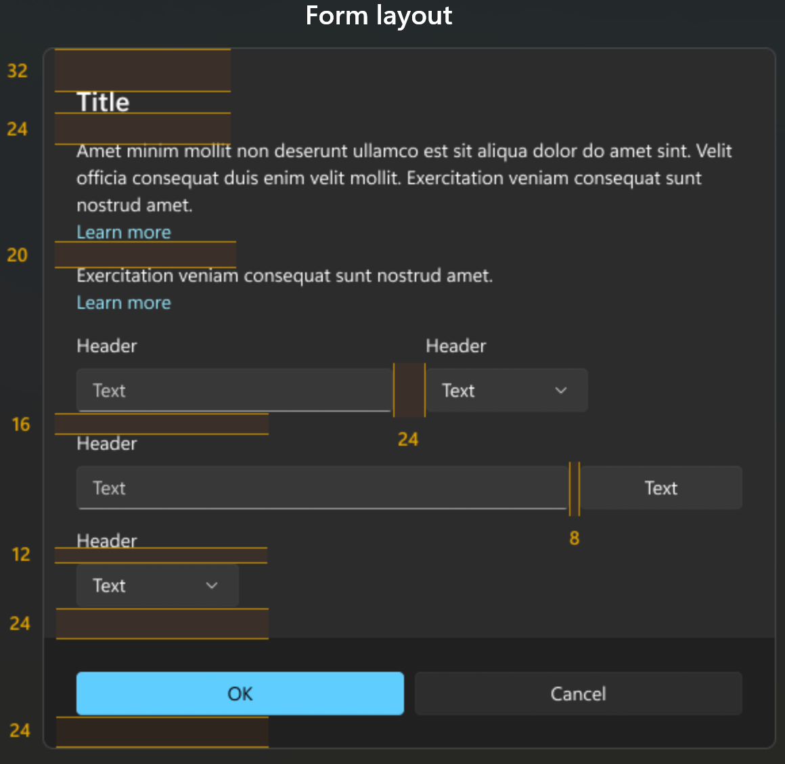
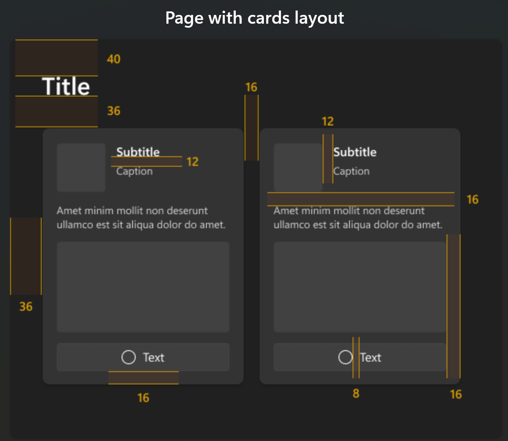

# Page design

## Form



```xml
<Window.SystemBackdrop>
    <MicaBackdrop />
</Window.SystemBackdrop>

<ScrollViewer HorizontalScrollBarVisibility="Auto">
    <StackPanel Orientation="Vertical" Padding="24">
        <TextBlock Text="My form" Style="{StaticResource TitleTextBlockStyle}" Margin="0,0,0,24"/>
        <TextBlock Margin="0,0,0,20" TextWrapping="WrapWholeWords" Width="500" HorizontalAlignment="Left">
            Use this oportunity to reveal your most inner secrets. 
            Be relieved that the PRISM program will never request this information.
        </TextBlock>
        <TextBlock Text="Name" Style="{StaticResource BodyStrongTextBlockStyle}" Margin="0,0,0,12"/>
        <TextBox Width="500" HorizontalAlignment="Left"/>
        <TextBlock Text="Sex" Style="{StaticResource BodyStrongTextBlockStyle}" Margin="0,16,0,12"/>
        <StackPanel Orientation="Horizontal">
            <RadioButton Content="Yes"/>
            <RadioButton Content="No"/>
            <RadioButton Content="Sometimes"/>
        </StackPanel>
        <TextBlock Text="Prefered pronoumns" Style="{StaticResource BodyStrongTextBlockStyle}" Margin="0,16,0,12"/>
        <ListBox Width="200" HorizontalAlignment="Left" SelectionMode="Extended">
            <x:String>He</x:String>
            <x:String>She</x:String>
            <x:String>It</x:String>
        </ListBox>
        <TextBlock Text="Province" Style="{StaticResource BodyStrongTextBlockStyle}" Margin="0,16,0,12"/>
        <StackPanel Orientation="Horizontal" Spacing="24">
            <ComboBox MinWidth="120">
                <ComboBoxItem Content="Quebec" IsSelected="True"/>
                <ComboBoxItem Content="Ontario"/>
                <ComboBoxItem Content="Fuck it"/>
            </ComboBox>
            <CheckBox Content="I regret it"/>
        </StackPanel>
        <TextBlock Text="Comments" Style="{StaticResource BodyStrongTextBlockStyle}" Margin="0,16,0,12"/>
        <TextBox 
            Width="500" Height="200" 
            HorizontalAlignment="Left" 
            AcceptsReturn="True" 
            ScrollViewer.HorizontalScrollBarVisibility="Auto"
            ScrollViewer.VerticalScrollBarVisibility="Auto"/>            
        <StackPanel Orientation="Horizontal" Margin="0,24" Spacing="8">
            <Button Width="80" Style="{StaticResource AccentButtonStyle}">OK</Button>
            <Button Width="80">Cancel</Button>
        </StackPanel>
```

## Cards

